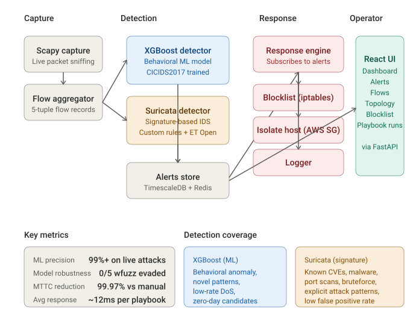

# Network Threat Intelligence & Automated Response Platform

Real-time network threat monitoring with ML-based anomaly detection (XGBoost on CICIDS2017), automated incident response (host isolation, IP blocking, YARA rule generation), and topology mapping for unauthorized device detection.

**Status:** 🚧 In active development (Day 1 of 7)

## Architecture

## Tech Stack

| Layer | Technology |
|-------|-----------|
| Capture | Scapy (AsyncSniffer) |
| Message Bus | Redis Streams |
| Storage | PostgreSQL + TimescaleDB |
| ML | XGBoost, Isolation Forest, scikit-learn |
| Backend | FastAPI, Python 3.11 |
| Frontend | React + Vite, shadcn/ui, vis-network |
| Infra | AWS EC2, Docker Compose |

## Quickstart

_Coming Day 7_

## Evaluation

_Coming Day 7 — see [docs/eval-report.md](docs/eval-report.md)_
## Progress

- [x] **Day 1** — AWS infra, IAM, Postgres + Redis + FastAPI scaffold ([v0.1-day1-foundation](../../releases/tag/v0.1-day1-foundation))
- [ ] Day 2 — Scapy capture, flow aggregation, React frontend
- [x] **Day 3** — ML detection: dual-model pipeline ([eval report](docs/eval-report.md), [v0.3-day3-detection](../../releases/tag/v0.3-day3-detection))
- [ ] Day 4 — Automated response (host isolation, IP blocking)
- [ ] Day 5 — YARA auto-generation
- [ ] Day 6 — Topology mapper, dashboard, polish
- [ ] Day 7 — Validation, demo video, final docs

## License

MIT
